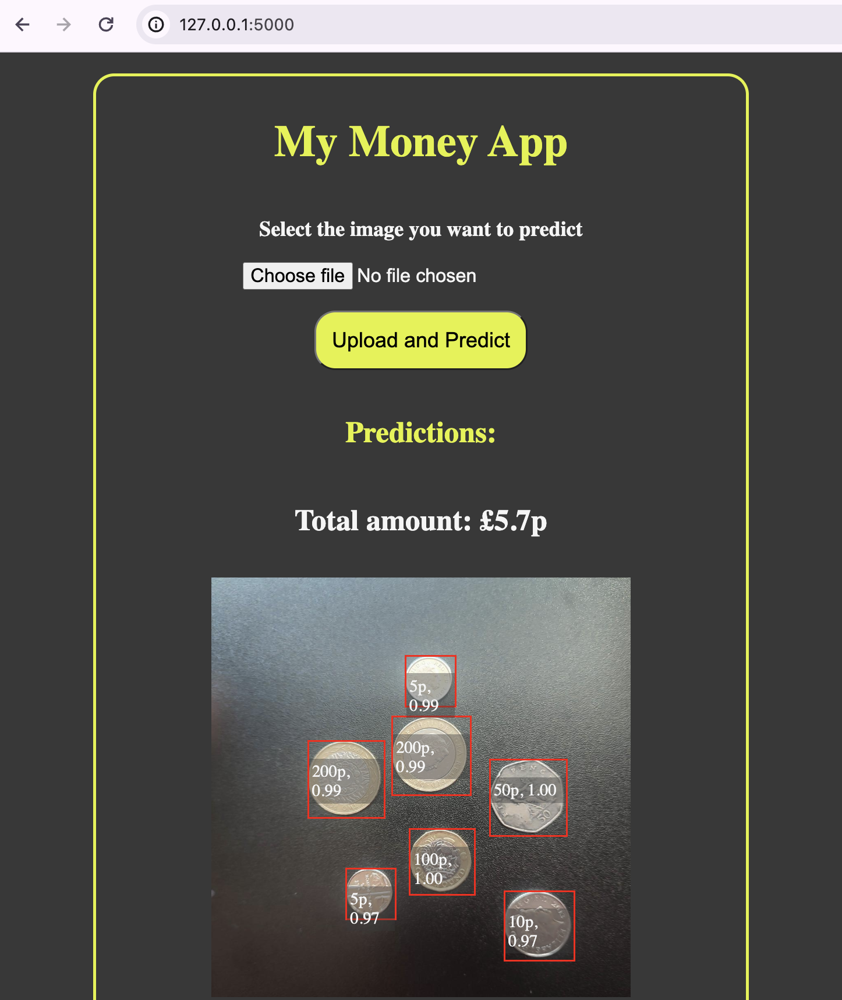

# Money Counter AI
An AI tool that counts coins using computer vision


### Video Demonstration
See YouTube video [Build A Computer Vision App from Start to Finish](https://www.youtube.com/playlist?list=PL4gEDuKXcNsN14oPI5TcjJy8yiFoqnNzp)

## Setup

### Clone this repo
```
git clone https://github.com/Uniqcoda/money-app
```

### Download raw images from Google Drive and move to the raw_images folder
[Google Drive](https://drive.google.com/drive/folders/1p5NkobelOHDBf0LYjugW_xLyRJDFdBT_?usp=sharing)

### Enter the directory or open in your favorite code editor
```
cd money-app
```

### Create a virtual environment. The common way to name virtual environments is `env`. But you can give it a different name if you need to identify it elsewhere, like on Jupyter notebook or jupyterLab. So, we would use `.coin_env` instead.
```
python3 -m venv .coin_env
```

*Add this virtual environment to your .gitignore file, under the `Environments` section, so you don't push it to GitHub.*

### Activate the virtual env
```
source .coin_env/bin/activate # Linux/Mac
.\.coin_env\Scripts\activate # Windows 
```

### Upgrade pip
```
python3 -m pip install --upgrade pip
```

### If working on Jupyter notebook, and you need the virtual env, run this code in your terminal, then go to jupyter nb and select the virtual env from the list of kernels. 
```
pip install ipykernel
python3 -m ipykernel install --user --name=coin_env
```

On Jupyter notebook


On JupyterLab  


## Image Preprocessing
[Video reference](https://youtu.be/Z4m0axcriuw?si=To0N2WfH6jZdhTjz)  

### 1. Install Pillow (on the virtual env)
```
python3 -m pip install --upgrade Pillow
```

### 2. Run script to resize and crop images
Add collected images to the `raw_images` folder  

If running from vscode, run
```
python3  preprocess.py
```
If on Jupyter notebook, run the `preprocess_images.ipynb` file

*Your cleaned images should be in the /images folder.*


## Image Upload & Labelling
This step would be done on the GCP VertexAI platform. Follow the [image upload and labelling video](https://youtu.be/Z4m0axcriuw?si=8bZe3-x8HiiCSp11) for further instructions.

## Model Training, Evaluation & Deployment
This step is also done on GCP VertexAI platform. Follow the [Model Training video](https://youtu.be/fZ6-Tq8K0vw?si=rPS9LaG3CmphyYLq) for further instructions.

## Web App Setup
We would be using the endpoint from the deployed model in the previous step to create predictions for the web app.  

1. Install dependencies  
```
pip install Flask google-cloud-aiplatform
```

2. Google cloud service account authentication 
Ref: https://developers.google.com/identity/protocols/oauth2/service-account#python  
Follow the setup instructions to  (i) create a service account and (ii) create a service account key  
The new service account key will be downloaded to your computer. Move it to the directly you need. Then add the file path to the script below and run
```
export GOOGLE_APPLICATION_CREDENTIALS="path/to/downloaded_key.json"
```


3. Start the Flask app
```
flask run
```


Sample model prediction result for single object detection
```
python3 test-prediction.py
```
Result

```json
{
    "bboxes": [[0.316620409, 0.678313732, 0.435367882, 0.789723396]],
    "confidences": [0.994227529], 
    "displayNames": ["2p"], 
    "ids": ["2112341057353023488"]
}
```
Docs: https://cloud.google.com/vertex-ai/docs/image-data/object-detection/interpret-results 

4. Final app

